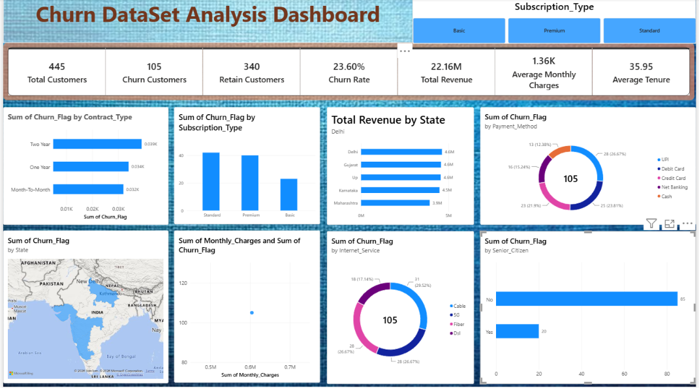

# Churn Data Analysis

An end-to-end customer churn analysis project covering data cleaning, exploratory analysis, and interactive dashboard reporting.

## Dashboard preview

The Power BI dashboard summarizes customer churn patterns and provides an interactive view of the analysis.

### Dashboard recording

The dashboard walkthrough is embedded below. It is configured to autoplay silently where the browser and GitHub allow it:

<video src="Dashboard-Recording.mp4" autoplay muted loop playsinline controls width="800">
  Your browser does not support embedded videos. [Open the dashboard recording](Dashboard-Recording.mp4).
</video>

If autoplay is blocked, use the controls above or [open the dashboard recording](Dashboard-Recording.mp4).

## Project workflow

1. Start with the unclean customer churn dataset.
2. Clean and prepare the data using the Jupyter notebook.
3. Export the cleaned data for analysis.
4. Present the findings in an interactive Power BI dashboard.

## Project files

| File | Description |
| --- | --- |
| `Churn Dataset Cleaning.ipynb` | Notebook used to clean and prepare the dataset |
| `Churn_Unclean_Project.xlsx` | Original unclean source workbook |
| `Clean_Churn_Data.csv` | Cleaned dataset used for analysis |
| `Churn Dataset Analysis Dashboard.pbix` | Power BI dashboard |
| `Churn Dataset Cleaning.pdf` | Exported data-cleaning documentation |
| `Complete Project Flow.docx` | Project workflow documentation |
| `Screenshot-Dashboard.png` | Dashboard preview image |
| `Dashboard-Recording.mp4` | Dashboard walkthrough recording |

## Tools used

- Python
- Jupyter Notebook
- Pandas
- NumPy
- Microsoft Power BI
